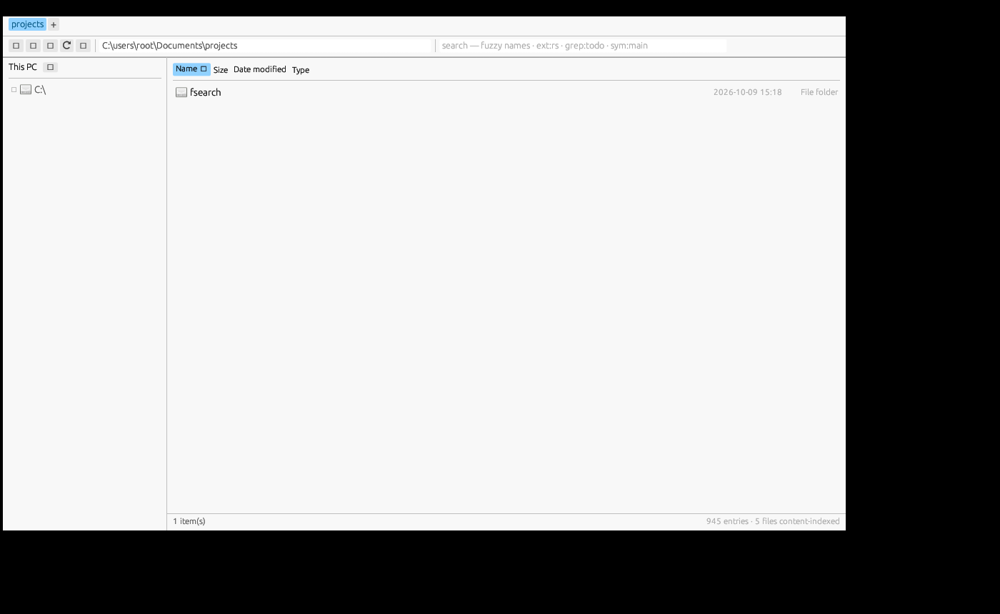

# FSearch for Windows

Whole-disk file search for Windows. Finds any file by name in about a
millisecond, forgives typos, and searches inside files with an index. Use it
as a CLI (with a small daemon) or as a Rust crate.

```
cargo build --release --target x86_64-pc-windows-gnu
target\x86_64-pc-windows-gnu\release\fsearch.exe install     # -> %LOCALAPPDATA%\Programs\FSearch
fsearch fsearch main              # find files by name
fsearch "ext:rs grep:apply_dir"   # search inside files
```

This is a port of [noahdunnagan/fsearch](https://github.com/noahdunnagan/fsearch)
(MIT), which does the same thing on macOS. The query language, the CLI, the
JSON protocol, the index layout, the ranking and the daemon design are the
original's; the platform layer is Win32. What changed and why is in
[`PORTING.md`](PORTING.md).

## Speed

Measured under Wine on a 9-file tree (so treat these as "it works", not as a
benchmark): a cold crawl of the tree took ~12 ms, a name search ~1.6 µs
median, and a created or deleted file showed up in ~1 s. On a real NTFS volume
with millions of entries, expect the shape of the original's numbers — a first
crawl of the whole disk on the order of a minute, then ~1 ms name searches —
with the constant factors set by your disk and `ReadDirectoryChangesW`.

| | |
|---|---|
| find a file by name, whole disk | ~1 ms |
| search inside files | ~10 ms |
| a new, renamed or deleted file shows up | ~0.1–1 s |
| first crawl of the disk | ~1 min, once |
| restart | seconds: only folders whose mtime moved are relisted |

## The explorer window

`fsearchui.exe` (or `fsearch ui`, or double-clicking `fsearch.exe`) opens a real
file-explorer window, drawn with egui:



- **Tabs**, a resizable **folder tree**, back/forward/up, an editable address bar
- A **virtualised list** with per-type icons and Name / Size / Date modified /
  Type columns, sortable by clicking a header; folders first
- **Live search** in the same bar: type and results stream in from the daemon as
  you type, with the folder each hit lives in and the query time in the status bar


- Right-click for Open / Open in a new tab / Show in Explorer / Cut / Copy /
  Paste / New folder / Rename / Delete / Copy path / Properties
- Keyboard: `Ctrl+T` new tab, `Ctrl+W` close, `Alt+←/→/↑` navigate, `F5`
  refresh, `F2` rename, `Del` to the Recycle Bin, `Ctrl+C/X/V/A`, `Enter` open,
  `Ctrl+L` or `Esc` clears the search
- Delete goes to the Recycle Bin; open uses the shell's own associations; the
  type column is read from `HKCR` the way Explorer reads it

It shares the daemon's index, so search is the same ~1 ms it is everywhere
else, and the list refreshes itself when the folder changes on disk.

## Interactive

Double-clicking `fsearch.exe` — or running `fsearch -i` — drops you into a
prompt instead of printing help and exiting:

```
fsearch> readme
C:\users\me\dev\fsearch\README.md                        (3 ms)

fsearch> grep:todo
...
```

Queries, `status`, `doctor`, `install` and `uninstall` all work there. The
first run crawls every disk; `status` shows how far along it is.

## If it does not start

Run:

```
fsearch doctor
```

It exercises each subsystem on its own — volumes, the bulk directory class,
attributes, memory maps, the index layout, the named pipe, the change stream,
the trigram index, the registry — and prints the real OS error next to whatever
fails, instead of a window that closes before you can read it.

Two log files sit next to the index in `%LOCALAPPDATA%\FSearch`:

- `trace.log` — a timestamped line per startup stage, flushed before the next
  one runs, so the last line is the stage that died.
- `crash.log` — Rust panics with a backtrace, and faults *below* Rust (a bad
  pointer, a stack overflow) with the exception code and address, caught by a
  structured exception handler that allocates nothing.

Double-clicking `fsearch.exe` now waits for a keypress before closing, so usage
text and errors stay on screen. Set `FSEARCH_TRACE=1` for per-stage detail.

The shipped binaries link the C runtime statically, so they need no Visual C++
Redistributable — a missing `VCRUNTIME140.dll` otherwise looks exactly like a
crash on launch.

## Queries

```
fsearch "readme in:~/dev"                  # inside a folder
fsearch "type:image size:>5mb mtime:<7d"
fsearch "ext:rs regex:fn\s+\w+_dir"        # regex inside files
fsearch "sym:apply_dir"                    # where it's defined
```

Words are fuzzy, and 5+ letter words forgive one typo (`mian.rs` finds
`main.rs`). Also `'exact`, `^prefix`, `suffix$` and `!exclude`. Filters:
`ext:` `type:` `kind:` `in:` `size:` `mtime:` `re:` `path:` `grep:` `regex:`
`sym:` `limit:`. Content search is smart-case.

`type:` knows `image` `video` `audio` `doc` `code` `archive` `font`, plus
`app`/`program` for Windows executables and packages (`.exe` `.msi` `.msix`
`.appx` `.lnk` …). Paths can be written with either separator; `in:` accepts
`~`, `C:\dev` and `C:/dev`.

## Administrator

Run from an elevated terminal and it indexes everything. As a standard user it
indexes everything you can read and quietly skips the folders you cannot
(other profiles, `System Volume Information`, `$Recycle.Bin`, `Windows\CSC`),
instead of failing on them. Elevated, it also takes `SeBackupPrivilege` so
protected folders can be listed.

OneDrive and other cloud-files placeholders are listed but never opened, so a
search cannot make Windows download anything.

## Two executables

`fsearch.exe` is a console program — the shell waits for it and its output
goes to your terminal. `fsearchd.exe` is the same code built without a
console, and it is what the sign-in entry and the CLI's auto-start launch, so
no window ever flashes. `install` copies both.

## API

JSON lines over the named pipe `\\.\pipe\fsearch-s<session>`, or
`fsearch stdio`:

```json
{"q": "fsearch main", "limit": 20}
{"op": "grep", "pattern": "apply_dir", "in": "~/dev"}
```

Ops: `search` (default), `grep`, `status`, `save`, `ping`. Any filter key may
also be its own field (`{"q": "main", "ext": "rs", "in": "~/dev"}`), and an
`id` you send comes back on the response.

Or link the crate:

```rust
let engine = fsearch::Engine::start(fsearch::Options { dir: fsearch::default_dir(&home), home: home.clone(), skip: None })?;
let hits = engine.search(&fsearch::Query::parse("fsearch main", &home)?)?;
```

An app and the CLI share one index: the first process owns it and the others
follow along.

## How it works

- Crawls every fixed volume once with `GetFileInformationByHandleEx` in
  `FileIdBothDirectoryInfo` mode, which returns hundreds of entries per call
  with name, attributes, size and mtime already attached — so no per-file
  stat. `FindFirstFileExW` stands in on filesystems without file ids.
- Stays current from `ReadDirectoryChangesW`, one recursive watch per volume.
  Each notification is reduced to "this folder changed" and that folder is
  relisted and diffed, so the update is idempotent.
- Windows' change stream has no replayable history, so a restart catches up
  the way the original recovers from lost FSEvents history: relist every
  folder whose mtime moved since the index was last known complete, plus the
  folders of indexed text files edited in place.
- Names live in one mmap'd file, laid out folder by folder so `in:` is a
  range. Every volume hangs off one virtual root, so that stays true across
  disks. Each distinct name is scored once.
- Content search uses a trigram index of your text files. Matches are read
  fresh from disk, so they're never stale.
- Junctions, symlinks and mount points are not followed, which is what keeps
  `WinSxS` and `Users\All Users` from being indexed several times over.

## Building and testing

```
cargo build --release          # on Windows: builds fsearch.exe and fsearchd.exe
./cross.sh                     # from Linux/macOS: cross-builds both into dist/
cargo test                     # the engine, on this machine
```

`cross.sh` needs `rustup target add x86_64-pc-windows-gnu` and a MinGW-w64
cross compiler; it sets the linker through the environment rather than
`.cargo/config.toml`, so a native Windows build needs no configuration.

`cargo test` runs the real engine against a host backend that dresses a temp
folder up as the `C:` volume, so index layout, ranking, live diffs, the
trigram index and the daemon protocol are all covered off a Windows box. The
same hook is available in the Windows build: set `FSEARCH_ROOT` to index one
folder instead of the machine.

## License

MIT. Copyright (c) 2026 Noah Dunnagan for the original; see [`LICENSE`](LICENSE).
